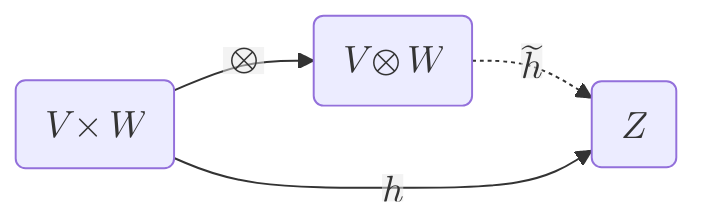

# Tensor

**definition** a _tensor_ is an element of the [[tensor#product]] of some number of [[vector space]]s

## Product

**definition** the _tensor product_ of two [[vector space]]s $V$ and $W$ (over the same [[field]]) is a [[vector space]] $V \otimes W$ to which is associated a [[linear map#bilinear map]] $V \times W \to V \otimes W$ that maps a pair $(v, w)$ to an element of $V \otimes W$ denoted $v \otimes w$ --- Wikipedia

**definition** the _tensor product_ of two [[vector]]s $v \in V$ and $w \in W$ is the [[vector]] $v \otimes w \in V \otimes W$ which is the image of $(v, w)$ under the [[linear map#bilinear map]] associated to the [[tensor#product]] $V \otimes W$ --- me

**definition** _universal property_ the _tensor product_ of two [[vector space]]s $V$ and $W$ is a [[vector space]] denoted $V \otimes W$, together with a [[linear map#bilinear map]] $\otimes : V \times W \to V \otimes W = (v, w).\ v \otimes w$, such that, for every [[linear map#bilinear map]] $h : V \times W \to Z$, there is a **unique** linear map $\tilde h : V \otimes W \to Z$, such that $h = \tilde h \circ \otimes$ (that is, $h\ (v, w) = \tilde h\ (v \otimes w)$ for all $v \in V \land w \in W$) --- Wikipedia

**representation** _universal property_

**properties**

$\dim\ (V \otimes W) = \dim V \times \dim W$

$(U \otimes V) \otimes W \cong U \otimes (V \otimes W)$

$V \otimes W \cong W \otimes V$

**definition** the _tensor product_ of a [[linear map]] $f : U \to V$ and a [[vector space]] $W$ is the unique [[linear map]] $f \otimes W : U \otimes W \to V \otimes W$ such that $(f \otimes W)\ (u \otimes w) = f\ u \otimes w$ for all $u \in U \land w \in W$. $W \otimes f$ is defined similarly --- Wikipedia and me

**definition** the _tensor product_ of two [[linear map]]s $f : U \to V$ and $g : W \to Z$ is the unique [[linear map]] $f \otimes g : U \otimes W \to V \otimes Z$ such that $(f \otimes g)\ (u \otimes w) = f\ u \otimes g\ w$ for all $u \in U \land w \in W$ --- Wikipedia

**properties**

$f \otimes g = (f \otimes Z) \circ (U \otimes g) = (V \otimes g) \circ (f \otimes W)$

## ---

--- <https://ncatlab.org/nlab/show/tensor+product+of+vector+spaces>

--- <https://en.wikipedia.org/wiki/Tensor_product>

--- <https://en.wikipedia.org/wiki/Tensor>

--- <https://en.wikipedia.org/wiki/Tensor_(intrinsic_definition)>
