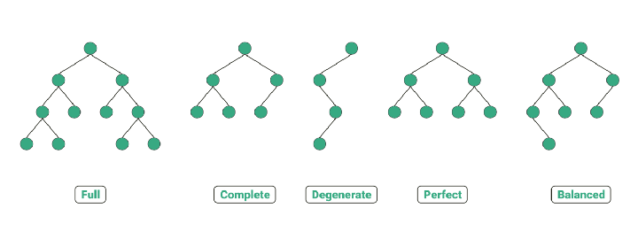

# Tree

**see** [[abstract data type]]

**definition** a _tree_ is an acyclic undirected [[graph]]

**definition** a _tree_ is a [[graph]] in which every node has exactly one parent, except for the _root node_, which has no parent &mdash; <https://en.wikipedia.org/wiki/Tree_(data_structure)>

> **note** in certain cases, it can be useful to set the parent of the _root node_ to itself

**definition** a _leaf_ is a node in a [[tree]] that has no children

**definition** the _root_ of a [[tree]] is the only node that has no parent (the node at the top of the [[tree]])

**definition** the _height_ of a [[tree]] is the number of edges on the longest path between the root and a leaf

**definition** a _subtree_ is a [[tree]] that is entirely contained within another [[tree]]

> **note** _subtrees_ can consist of a single node

**properties**

[[tree]]s have no cycles

## Binary Tree

**definition** a _binary tree_ is a [[tree]] in which every node has at most two children, which are referred to as the _left child_ and the _right child_ &mdash; <https://en.wikipedia.org/wiki/Binary_tree>

binary [[tree]]s can be implemented using a dynamic [[array]], where a node at index $i$ has its children at indices $2i : 1$ and $2i : 2$ and its parent at index $\operatorname{floor} i \text- 2$

**types**

 &mdash; <https://towardsdatascience.com/5-types-of-binary-tree-with-cool-illustrations-9b335c430254>

**applications**

used in the implementation of binary [[heap]]s

used in the implementation of [[abstract syntax tree]]s

### Binary Tree Traversal

&mdash; <https://youtu.be/RBSGKlAvoiM?t=12886>

**see** [[depth-first search]], [[breadth-first search]]

**representation** _pre-order traversal_

print values before recursive calls

```python
def preorder(node):
  if node is None: return
  print(node.value)
  preorder(node.left)
  preorder(node.right)
```

**representation** _in-order traversal_

print values between recursive calls

```python
def inorder(node):
  if node is None: return
  inorder(node.left)
  print(node.value)
  inorder(node.right)
```

**representation** _post-order traversal_

print values after recursive calls

```python
def postorder(node):
  if node is None: return
  postorder(node.left)
  postorder(node.right)
  print(node.value)
```

**representation** _level-order traversal_

print values one level at a time

**see** [[breadth-first search]]
