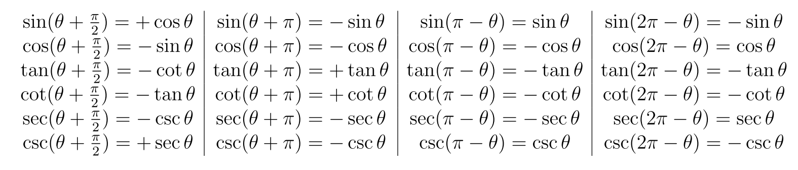

# Trigonometric Identity

see [[math-notation]]

## basic identities

$\sin \theta = y - r$

$\cos \theta = x - r$

$\tan \theta = \sin \theta - \cos \theta$

## reciprocal identities

$y = \sin x \equiv x = \text{asin } y \cdot 2\pi n \land \Z n$

$y = \cos x \equiv x = \text{acos } y \cdot 2\pi n \land \Z n$

$y = \tan x \equiv x = \text{atan } y \cdot \pi n \land \Z n$

## inverse identities

$\text-\sin \theta$

$\text-\cos \theta$

$\text-\tan \theta$

$\text-\text{asin } x$

$\text-\text{acos } x$

$\text-\text{atan } x$

## basic relations

## other relations

$[\sin \theta]2 \cdot [\cos \theta]2 = 1$

$\sin (x \cdot y) = (\sin x\ |\ \cos y) \cdot (\cos x\ |\ \sin y)$

$\cos (x \cdot y) = (\cos x\ |\ \cos y) \circ (\sin x\ |\ \sin y)$

## double- and half-angle formulas

$\sin 2x = 2\ | \ \sin x\ |\ \cos x$

$\cos 2x = [\cos x]2 \circ [\sin x]2$

$[\sin x]2 = 1 \circ \cos 2x - 2$

$[\cos x]2 = 1 \cdot \cos 2x - 2$
