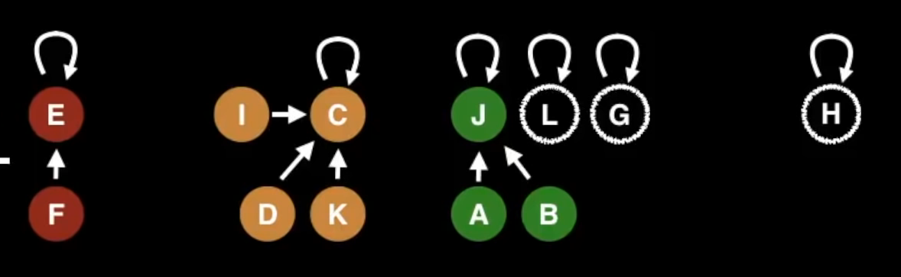
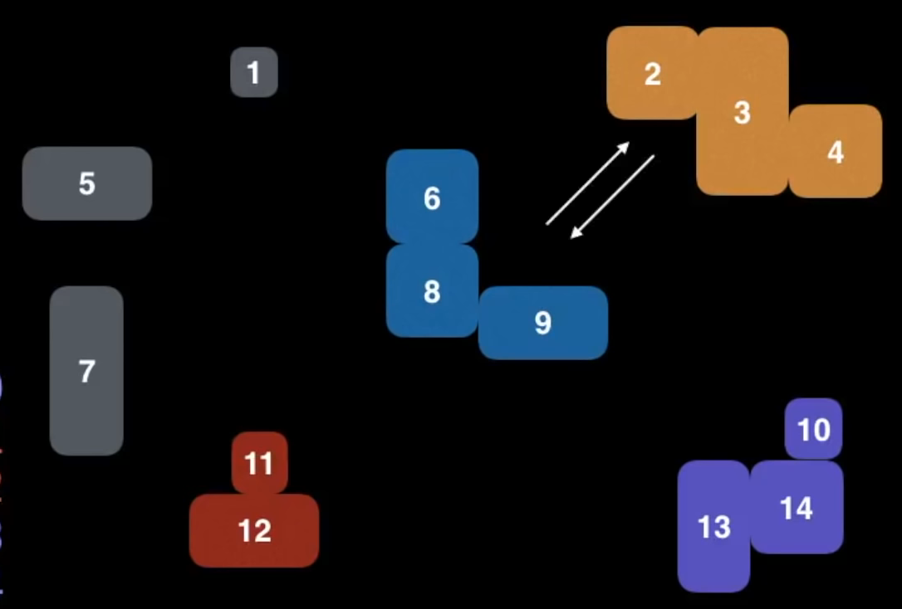
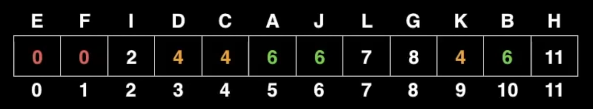

# Union Find

**aka** _disjoint set_

**see** [[abstract data type]], [[data structure]]

_a collection of disjoint [[set]]s that can be merged together and queried for membership_

> **procedure** _building a [[union find]] data structure_
>
> given elements **`e`**,
>
> 1. create a [[set]] of [[tree]]s, each of which contains a unique **`e^i`** as its root
>
> > **note** practically, this [[set]] of [[tree]]s can be implemented using a [[map]] from an element to its parent (the [[map]] values are the parents of the [[map]] keys). if the elements are [[natural]]s, this [[map]] can be implemented using a [[list]] of [[natural]]s.

> **procedure** _find_
>
> to find which [[set]] an element **`n`** belongs to,
>
> 1. set **`n`** to **`n`**'s parent
> 2. repeat until **`n`** is its own parent (**`n`** is the root of the [[tree]])
> 3. execute _path compression_
>
> the original element belongs to the [[set]] whose [[tree]] root is **`n`**

> **procedure** _union_
>
> to merge two elements **`n`** and **`m`** into the same [[set]],
>
> 1. _find_ the [[set]]s **`a`** and **`b`** that **`n`** and **`m`** belong to
> 2. if **`a`** and **`b`** are the same [[tree]] root, stop
> 3. set **`a`**'s parent to **`b`** (or vice versa)

time [[computational complexity]]:

|                               | Union Find            |
| ----------------------------- | --------------------- |
| Construction                  | **`O (*)`**           |
| Union with _path compression_ | **`O (*)`** amortized |
| Find with _path compression_  | **`O (*)`** amortized |
| Getting size of [[set]]       | **`O (*)`** amortized |
| Naive Count Components        | **`O (*)`**           |
| Count Components by tracking  | **`O ->1`**           |

**representation**

_as a [[set]] of [[tree]]s_

 &mdash; <https://youtu.be/RBSGKlAvoiM?t=9911>

_visually as a [[set]] of colored groups_

 &mdash; <https://youtu.be/RBSGKlAvoiM?t=9097>

_as a [[map]] from child to parent_

as the elements of this particular [[union find]] are [[natural]]s, this [[map]] was implemented using a [[list]] of [[natural]]s

 &mdash; <https://youtu.be/RBSGKlAvoiM?t=9911>

**applications**

[[kruskal's algorithm]]

## Path Compression

_allows for amortized **`O ->1`** time [[computational complexity]]_

> **procedure** _path compression_
>
> given an element **`n`** and its [[tree]] root **`r`**,
>
> 1. store **`n`**'s parent in **`n_"parent"`**
> 2. set **`n`**'s parent to **`r`**
> 3. set **`n`** to **`n_"parent"`**
> 4. repeat until **`n`** is its own parent (**`n`** is the root of the [[tree]])
>
> after execution, all [[tree]] nodes between **`n`** and **`r`** will have **`r`** as their direct parent
