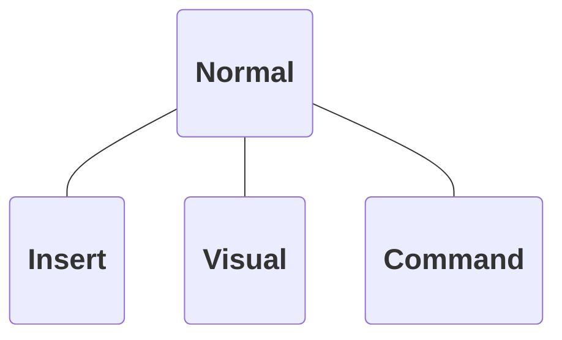

# Vim

[//]: # 'see [[public-speaking]]'
[//]: # 'prep:'
[//]: # 'disable markdown github styling'
[//]: # 'open MosaicLarge in new window'
[//]: # 'prepare demo table in same window'
[//]: # 'C-S-P Editor Font Zoom in x12'

            

## Background

[//]: # 'a set of key bindings?'
[//]: # 'efficient'

            

## Modes

[//]: # 'I and ESC'

 

            

## Normal Mode

            

## Normal Mode

### Motion Commands

 

|                        |              |
| ---------------------- | ------------ |
| _h_ _j_ _k_ _l_ &emsp; | (arrow keys) |
| _w_                    | word         |
| \_                     | line         |

[//]: # 'USE NUMBERS'

            

## Normal Mode

### Verb Commands

 

|              |             |
| ------------ | ----------- |
| **d** &emsp; | delete      |
| **y**        | yank (copy) |
| **p**        | paste       |

            

## Normal Mode

### Phrases

 

|                  |                  |
| ---------------- | ---------------- |
| **d**_w_         | delete word      |
| **y**2*w* &emsp; | yank two words   |
| **y**\_          | yank line        |
| **d**2\_         | delete two lines |
| $\dots$          | $\dots$          |

[//]: # 'easy to remember, switch keyboard layouts'

            

## Demo

            

[//]: # 'learn Vim!'
[//]: # 'disadvantage: frustrating'
