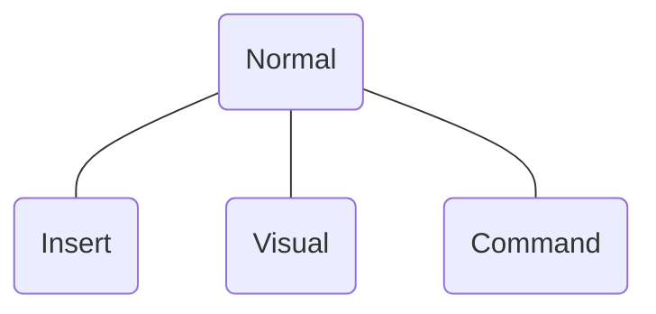

# Vim

  

[//]: # 'see [[public-speaking]]'
[//]: # 'prep:'
[//]: # 'open new VSCode window'
[//]: # 'turn on screen cast mode'
[//]: # 'open MosaicLarge in window'
[//]: # 'open demo table in window'
[//]: # 'zoom in 3x'

---

## Background

  

[//]: # 'a set of key bindings?'
[//]: # 'efficient'

---

## Modes

  

[//]: # 'I and ESC'

---

## Normal Mode

  

---

## Normal Mode

#### Motion Commands

  

|                        |              |
| ---------------------- | ------------ |
| _h_ _j_ _k_ _l_ &emsp; | (arrow keys) |
| _w_                    | word         |
| \_                     | line         |

[//]: # 'USE NUMBERS'

---

## Normal Mode

#### Verb Commands

  

|              |             |
| ------------ | ----------- |
| **d** &emsp; | delete      |
| **y**        | yank (copy) |
| **p**        | paste       |

[//]: # 'nothing happened...'

---

## Normal Mode

#### Phrases

  

|                  |                  |
| ---------------- | ---------------- |
| **d**_w_         | delete word      |
| **y**2*w* &emsp; | yank two words   |
| **y**\_          | yank line        |
| **d**2\_         | delete two lines |
| $\dots$          | $\dots$          |

[//]: # 'easy to remember, switch keyboard layouts'

---

## Demo

  

---

[//]: # 'learn Vim!'
[//]: # 'disadvantage: frustrating'
